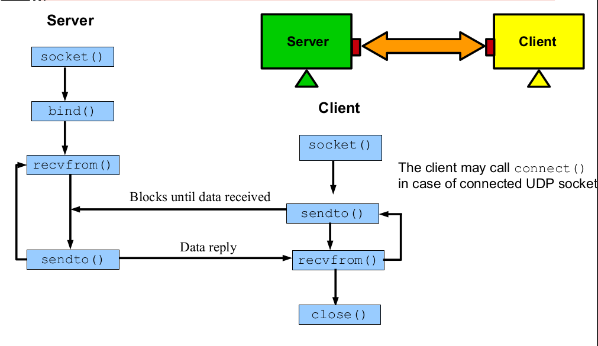

# Datagram Sockets (UDP)

Datagram sockets (**SOCK_DGRAM**) provide **unreliable**, full-
duplex, **packet**-**oriented** communication channel.

- Messages are transmitted and received in terms of **datagrams**,
which is a small, **fixed**-**length** packet.
- A process either reads the **entire** message or in case of error does
not read any data.
- **Unreliable** means there is no **sequence** numbering, so messages
may **arrive** out of order, be **duplicated** or not **arrive** at all.
- Datagram sockets can be **connected** as well as **unconnected**.

## System Calls Graph

- [sendto()](../socketfunctions.md)
- [recvform()](../socketfunctions.md)

---

### Datagram Sockets

---

- **Connectionless Datagram Sockets** Mostly the datagram sockets
are **connection**-**less**, i.e., the client do not call **connect**(), rather
address every message using **sendto**() and **recvfrom**()
calls. It is possible for a process to call **sendto**() to different
server processes.

- **Connection-Oriented Datagram Sockets** If a UDP client calls
**connect**() and specifies the **UDP** server address, the socket is
said to be **connected**. From that point onward, the client may only
**send** to and **receive** from the address specified by connect. So you
don't have to use **sendto**() and **recvfrom**(). You can simply
use **send**() and **recv**() calls. Normally UDP sockets do not
use connect. However, UDP sockets may use **connect**()
multiple times to change their **association**.

Stream Sockets | Datagram Sockets |
|:----------------:|:--------------------:|
Fragment/Reassemble| No
Ordering           | No
Reliable           | May not arrive
Connected          | Multiple senders

 

**Datagram** Sockets, therefore, place less load on kernel network
code and on NW traffic. Datagrams may get lost in **transit**, and
they may arrive out of order. For these two reasons, datagram
sockets are best suited to applications in which **simplicity**,
**efficiency**, and speed are more important than data **integrity** and
**consistency**. They are a **bad** choice for **web**, file or **email** servers.
As they can be large documents. They are good choice for **streams**
of **music** and **video** where a missing note or frame may not even
be **noticed**.