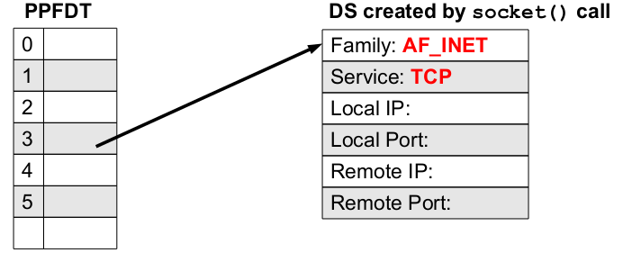

# Functions in socket programming

### Socket()

---

``````C
int socket(int domain, int type, int protocol);
``````

**socket**() creates an endpoint for communication.

- On success, a file **descriptor** for the new socket is returned.
- On failure, **-1** is returned and **errno** is set appropriately.
- The first argument domain specifies a **communication** domain under.
which the communication between a pair of **sockets** will take place.
- Communication may only take place between a **pair** of sockets of the **same**
type.
- These families are defined in **/usr/include/x86.../bits/socket.h**

|Domain|Communication Performed|Applcations|Address Format|Address Structure|
|:-:|:-:|:-:|:-:|:-:|
|AF_UNIX|IPv4|On same host|pathname|sockaddr_run|
|AF_INET|IPv4|On host connected via **IPv4** network|**32**-bt IPv4 addr +16-bit port#|sockaddr_in|
|AF_INET6|IPv6|On host connected via **IPv6** network|**128**-bt IPv6 addr +16-bit port#|sockaddr_in6|

- The **second** argument type specifies the communication semantics.
These types are defined in the header file
/usr/include/x86.../bits/socket_type.h. Most common
types are **SOCK_STREAM** and **SOCK_DGRAM**.
- The **3rd** argument specifies the protocol to be used within the network
code **inside** the **kernel**, not the **protocol** between the client and server. Just
set this argument to “0” to have socket() choose the correct protocol
based on the type. You may use constants, like **IPPROTO_TCP**,
**IPPROTO_UDP**. You may use **getprotobyname**() function to get
the official protocol name.You may look at
**/etc/protocols** file for details.

``````C
int sockfd = socket(AF_INET, SOCK_STREAM, 0);
``````

- The socket data structure contains several pieces of information for the
expected style of IPC, including **family/domain, service type, local IP, local port, remote IP, and remote port**.
- UNIX kernel **initializes** the first two fields when a socket is created.
- When the **local** **address** is stored in socket data structure we say that the
socket is **half** associated.
- When both **local** and **remote** addresses are stored in socket data structure,
we say that socket is **fully** associated.



Stream sockets (SOCK_STREAM) provide a **reliable**, full-duplex,
**stream**-**oriented** communication channel. Stream sockets are used to
communicate between only two **specific** processes (point-to-point),
and are described as **connection**-**oriented**. Do not support
**broadcasting** and **multicasting**.

- Full Duplex
- Stream Oriented
- Reliable
- Error detection using checksum
- Flow control using sliding window
- Congestion Control
  - Sender-side congestion window.
  - Receiver-side advertised window.

### connect()

---

``````C
int connect(int sockfd, const struct sockaddr *svr_addr, int addrlen);
``````

- The **connect**() system call connects the socket referred to by the
descriptor **sockfd** to the **remote** server (specified by svr_addr)
- If we haven't call **bind**(), (which we normally don't in client), it
**automatically** chooses a **local** end point address for you.
- On success, **zero** is returned, and the **sockfd** is now a valid file descriptor
open for reading and writing. Data written into this file descriptor is sent to
the socket at the **other** **end** of the connection, and data written into the
other end may be **read** from this file descriptor.
- TCP sockets may **successfully** connect only **once**. UDP sockets normally
do not use **connect**(), however, **connected** UDP sockets may use
**connect**() **multiple** times to change their **association**.
- When used with **SOCK_DGRAM**
type of socket, the connect() call
simply stores the address of the **remote** socket in the **local** socket's data
structure, and it may communicate with the other side using **read**() and
**write**() instead of using **recvfrom**() and **sendto**() calls.

#### connect() performs four tasks

- Ensure that the specified **sockfd** is valid and that it has not already
been **connected**.
- Fills in the **remote** end point address in the (client) socket from the
second argument.
- Automatically chooses a **local** end point address by calling **TCP/IP**
software.
- **Initiates** a TCP connection (3 way handshake) and returns a value to
tell the caller whether the **connection** **succeeded**.

### read() and write()

``````C
ssize_t read(int fd, void* buf, size_t count);
ssize_t write(int fd, const void* buf, size_t count);
``````

- The **read**() and **write**() system calls can be used to read/write from
**files, devices, sockets**, etc. (with any type of sockets stream or **datagram**)
- The **read**() call attempts to read up to **count** bytes from file **descriptor**
fd into the **buffer** starting at **buf**. If no data is available **read** blocks. On
success **returns** the number of **bytes** read and on error returns -1 with
**errno** set appropriately.
- The write() call writes **count** number of **bytes** starting from **memory**
location pointed to by **buf**, to file **descriptor** fd. On success returns the
**number** of bytes **actually** written and on **error** returns -1 with errno set
appropriately
- The **send**() and **recv**() calls can be used for **communicating** over
**stream** sockets or connected **datagram** sockets. If you want to use regular
**unconnected** **datagram** sockets (UDP), you need to use the **sendto**() and
**recvfrom**().

### send()

``````c
int send(int sockfd, const void* buf, int count,int flags);
``````

It will quite similar to **write** system call if we place **zero** in the 4th argument.

- The **send**() call writes the count number of bytes starting from
**memory** location pointed to by buf, to file **descriptor** sockfd.
- The **argument** flags is normally set to zero, if you want it to be
“normal” data. You can set flag as **MSG_OOB** to send your data as “out
of band”. Its a way to tell the **receiving** system that this data has a
**higher** priority than the normal data. The receiver will receive the signal
**SIGURG** and in the handler it can then receive this data without first
receiving all the rest of the normal data in the queue.
- The send()call returns the number of bytes **actually** sent out and this
might be less than the number you told it to send. If the value returned
by send() does not match the value in count, it's up to you to send
the rest of the string.
- If the socket has been **closed** by any side, the process calling send()
will get a **SIGPIPE** signal.

### recv()

``````c
int recv(int sockfd, void* buf, int count, int flags);
``````

It will quite similar to **read** system call if we place **zero** in the 4th argument.

- The recv() call attempts to read up to count bytes from file descriptor
sockfd into the buffer starting at buf. If no data is available it blocks
The argument flags is **normally** set to zero, if you want it to be a
regular **vanilla** recv(), you can set flag as **MSG_OOB** to receive out
of band data. This is how to get data that has been sent to you with the
MSG_OOB flag in **send**() As the receiving side, you will have had
signal **SIGURG** raised telling you there is urgent data. In your handler
for that signal, you could call **recv**() with this MSG_OOB flag
- The call returns the **number of bytes** actually read into the buffer, or -1
on error
- If recv() returns 0, this can mean only one thing, i.e., **remote side**
has **closed** the connection on you.

### Reading in a Loop

The data from a TCP socket should always be read in a loop until the
**desired** amount of data has been **received**.

A sample code snippet that do this job is shown

```C
char msg[128];
int n, nread, nremaining;
for(n=0, nread=0; nread < 128; nread += n){
  nremaining = 128 – nread;
  n = read(sockfd, &msg[nread], nremaining);
  if (n == -1) {perror(“read failed”); exit(1);}
}
printf(“%s\n”,msg);
```

### close()

```C
int close(int fd);
```

- After a process is done using the socket, it can call close() to close
it, and it will be freed up, never to be used again by that process
- On success returns zero, or -1 on error and errno
will be set
accordingly

The remote side can tell if this happens in one of two ways

- If the remote side calls read(), it will return **zero**.
- If the remote side calls write(), it will receive a signal **SIGPIPE**
and write() will return -1 and **errno** is set to **EPIPE**.

In practice, Linux implements a **reference** count mechanism to allow
**multiple** processes to **share** a socket. If n processes share a socket, the
reference count will be n. **close**() decrements the reference count
each time a **process** calls it. Once the **reference** count reaches **zero** (i.e.,
all processes have called close()) the socket will be **deallocated**.

### shutdown()

```C
int shutdown(int fd, int how);
```

When you **close** a socket descriptor, it closes both sides of the socket for
**reading** and **writing**, and frees the **socket** descriptor. If you just want to close
one side or the other, you can use **shutdown**() call.

- The argument **fd** is descriptor of the socket you want to perform this action
on, and the action can be specified with the how parameter.
  - **SHUT-RD(0)** Further receives are disallowed.
  - **SHUT-WR(1)** Further sends are disallowed.
  - **SHUT-RDWR(2)** Further sends and receives are disallowed.

#### Difference between close() and shutdown()

- **close**() closes the socket ID and **frees** the descriptor for the calling
process only, the **connection** is still opened if **another** process **shares** this
socket ID. The connection stays opened for both **read and write**.
- **shutdown**() **breaks** the connection for all processes sharing the socket ID.
It doesn't close the file descriptor or free the socket DS, it just change its
**usability**. To **free** a socket **descriptor**, you still have to call **close**().

### bind()

``````C
int bind(int sockfd, struct sockaddr* myaddr, int addrlen);
``````

- A socket created by a server process must be **bound** to an **address** and
it must be **advertised**. Thus any client process can later contact the
server using this address.
- The **bind**() call assigns the **address** given in the 2nd argument
**myaddr**, to the socket referred to by the **sockfd** given in the 1st
argument (obtained from a previous socket() call).
- The 2nd argument, **myaddr** is a pointer to a **structure** specifying the
**address** to which this socket is to be bound. There are different
address families and each having its **own** format. The type of
structure passed in this argument **depends** on the socket domain
- The **addrlen** argument specifies the **size** in bytes of the **address**
structure pointed to by **myaddr**
- On success, the call returns **zero**. On failure -**1** is returned and
**errno** is set appropriately.

### listen()

```C
int listen(int sockfd, int backlog);
```

The **listen**() system call requests the **kernel** to allow the specified
**socket** mentioned in the 1st argument to receive **incoming** calls. (Not all
types of sockets can receive incoming calls, **SOCK_STREAM** can).

- This call put a socket in **passive** mode and **associate** a queue where
**incoming** connection requests may be placed if the server is busy
accommodating a **previous** request.
- The **backlog** argument is the number of **connections** allowed on the
**incoming** queue. The **maximum** queue size depends on the socket
**implementation**.
- On success it **returns** zero and on **failure** -1 is returned and **errno** is set
appropriately.
- *We need to call **bind**() before we call **listen**(), otherwise the **kernel** will have us listening on a **random** port*.

### accept()

```C
int accept(int sockfd, struct sockaddr*callerid, socklen_t*addrlen);
```

The **accept**() system call is used by **server** process and returns a new
socket **descriptor** to use for a new client. After this the **server** process has
two socket **descriptors**; the **original** one (master socket) is still listening
on the port and new one (slave socket) is ready to be **read** and **written**.

- It is used with **connection**-based socket types (**SOCK_STREAM**).
- The argument **sockfd** is a socket that has been created with
**socket**(), bound to a **local** address with **bind**(), and is listening for
**connections**.
- On success, the **kernel** puts the address of the client into the second
argument pointed to by **callerid** and puts the length of that address
structure into the **third** argument pointed to by **addrlen**.
- On success return a **non-negative** integer that is a **descriptor** for the
accepted socket. On failure -**1** is returned and **errno** is set appropriately.

## For UDP we use

### sendto()

---

``````C
ssize_t sendto(int sockfd,const void *buf,size_t count,int flags, const struct sockaddr *dest_addr, socklen_t addrlen);
``````

Since datagram sockets are mostly **not** connected to a remote host, we
need to give the **destination** address before we send a packet.

- This call is **basically** the same as the call to **send**() with the addition
of two other pieces of information
- The argument **dest_addr** is a pointer to a struct
**sockaddr**
which contains the destination IP address and port, where the calling
process will send the data.
- The argument **addrlen**
can simply be set to sizeof(struct
sockaddr)
- Just like with **send**(), **sendto**()
returns the number of bytes
actually sent (which again, might be less than the number of bytes you
told it to send), or -1 on error.

### recvfrom()

---

``````C
int recvfrom(int sockfd, void* buf, int count, int flags, struct sockaddr* from, socklen_t* fromlen);
``````

Since datagram sockets are mostly **not** connected to a remote host, we need
to give the **address** from which we want to receive a packet.

- This call is basically the **same** as the call to **recv**() with the addition of
two other pieces of information.
- The last two arguments are used to obtain the address of the sender. The
address of the sender's socket will be **stored** in from, and the length of that
address will be stored in the **integer** pointed to by the last argument
**fromlen**. If we are not interested in the address of the sender, then we
specify both from and **fromlen** as **NULL**
- Just like with **send**(), **sendto**() returns the **number** of bytes actually
**received** (which again, might be less than you requested in the fromlen
parameter), or -1 on error
- If the remote side has **closed** the connection, **recvfrom**() will return **0**.
