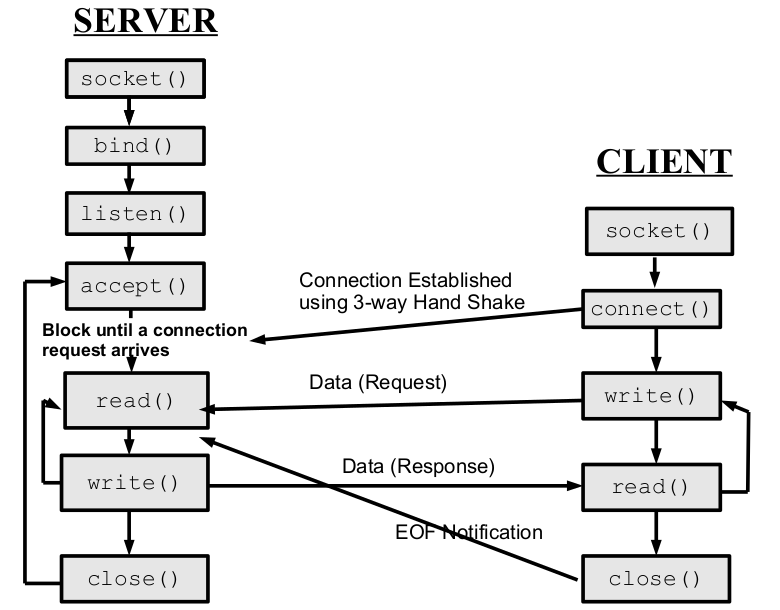
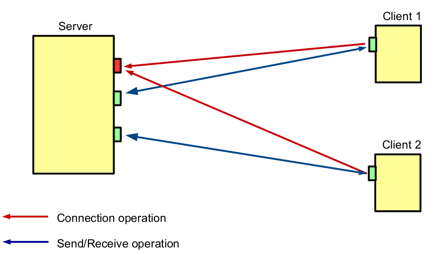
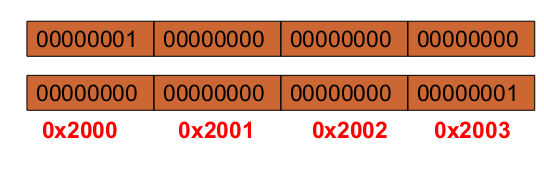
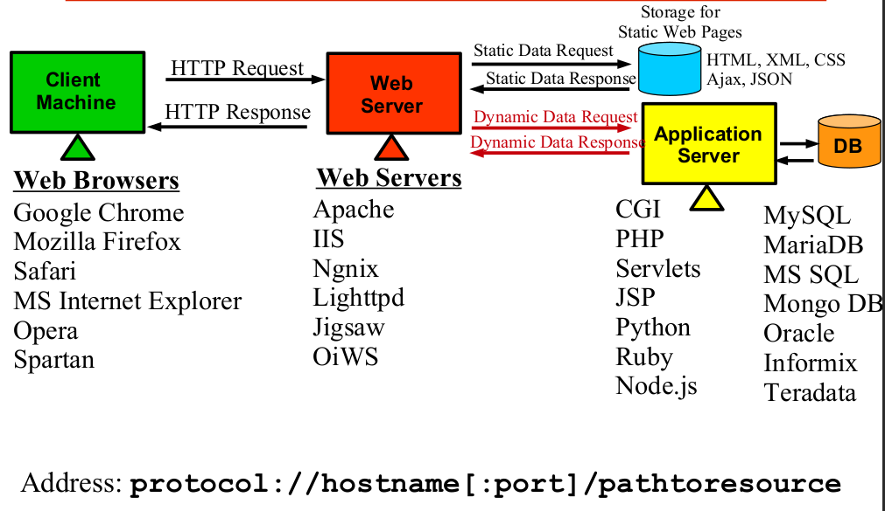

# Socket Programming

Socket programming is a way of enabling **communication** between computers over a network using **sockets**. Sockets provide a **programming** interface for network communication, allowing **processes** (programs) running on different computers to **send and receive data**.

```bash
# man them
strace
netstat -ant
nc
wireshark
xinetd
gethostbyname
```

[client server](../../img/sockets.png)

### What is a socket

---

A socket is a communication end point to which an application can
write data (to be sent to the underlying network) and from which
an application can read data. The process/application can be
related or unrelated and may be executing on the same or different
machines.

From IPC point of view, a socket is a **full-duplex** IPC channel that may
be used for communication between **related** or **unrelated** processes
executing on the **same** or **different** machines. Both communicating
processes need to **create** a socket to handle their side of **communication**,
therefore, a socket is called an **end** **point** of communication.

Available APIs for socket communication are

- For UNIX: **socket** and **XTI** / **TLI**
- For Apple Mac: **MacTCP**
- For MS Windows: **Winsock**

## Types

- **TCP/Stream sockets (SOCK_STREAM)**
- **UDP/Datagram sockets (SOCK_DGRAM)**

### TCP/Stream sockets (SOCK_STREAM)

---

- [socket()](../socketfunctions.md)
- [connect()](../socketfunctions.md)
- [bind()](../socketfunctions.md)
- [listen()](../socketfunctions.md)
- [accept()](../socketfunctions.md)
- [send()](../socketfunctions.md)
- [read() and write()](../socketfunctions.md)
- [recv()](../socketfunctions.md)
- [close()](../socketfunctions.md)
- [shutdown()](../socketfunctions.md)

#### System call Graph

---



#### Pictorial representation of TCP socket

---



### 3 Way HandShake (Making Connection)

---

The three-way handshake involves three steps to ensure that both the client and server are ready to exchange data reliably. Here's how the three-way handshake works

#### SYN (Synchronize)

The client **initiates** the process by **sending** a TCP segment with the SYN (**synchronize**) flag set to the server. This segment is commonly referred to as the "SYN segment."
The client selects an initial **sequence** number (ISN) for the communication, which is a random number used to **keep** **track** of the **bytes** of data exchanged.

#### SYN-ACK (Synchronize-Acknowledge)

The server receives the **SYN** segment from the **client** and acknowledges it by sending back a TCP segment with both the **SYN** and **ACK** (acknowledge) flags set. This segment is known as the **"SYN-ACK segment."**
The server also selects its **initial** sequence number (ISN) for the communication.

#### ACK (Acknowledge)

Upon receiving the SYN-ACK segment, the client sends an **acknowledgment** back to the server by sending a TCP segment with the **ACK** flag set. The client also **acknowledges** the server's initial **sequence** number (ISN).
At this point, the **connection** is **established**, and both the client and server are ready to **exchange** data. The ACK segment sent by the client may also **carry** any **additional** data, depending on the application.

After the **three-way handshake**, the connection is considered open, and data can be reliably exchanged between the client and server. The sequence numbers ensure that both sides keep track of the data being **sent** and **received**, allowing for proper ordering and **error** detection.


### 4 Way Handshake (Terminating Connection)

---

The four-way handshake ensures that both sides agree to **terminate** the connection properly. Here's how the four-way handshake works

#### FIN (Finish)

The party that wants to **close** the connection sends a TCP segment with the FIN (finish) flag set. This indicates that the sender has **finished** sending data and wants to close its side of the connection. This segment is commonly referred to as the **"FIN segment."**

#### ACK (Acknowledge)

Upon receiving the FIN segment, the **receiving** party sends an acknowledgment (ACK) back to the sender to confirm that it **received** the FIN segment.

#### FIN from Other Side

The receiving party, which has also **finished** sending data and wants to close its side of the connection, sends its **own** FIN segment.

#### ACK from Other Side

Upon receiving the FIN segment from the other side, the **original** sender of the FIN segment sends an acknowledgment (ACK) back to **confirm** that it received the **second** FIN segment.


### Socket API for TCP connection

---

#### How addresses in socket data structure are populated

#### For Client

- Remote end point address is populated by connect().
- Local end point address is automatically populated by TCP/IP s/w when client calls connect().

#### For Server

- Local end point addresses are populated by bind().
- Remote end point addresses are populated by accept().

### Socket Address Structures (SAS)

---

#### Generic SAS

This is a basic template on which other address
data structures of **different** domains are based. When sa_family is **AF_UNIX** the **sa_data**
field is supposed to contain a pathname as the socket's address. When **sa_family** is
**AF_INET** the **sa_data** field contains both an **IP** address and a **port** number.

```C
struct sockaddr
{
  u_short sa_family;
  char sa_data[14];
}
```

#### Internet SAS

```C
struct in_addr{
 in_addr_t s_addr;
}
```

```C
struct sockaddr_in
{
 u_short sin_family;
 u_short sin_port;
 struct in_addr sin_addr;
 char sin_zero[8];
}
```

#### UNIX Domain SAS

``````C
struct sockaddr_un
{
  short sun_family;
  char sun_path;
}
``````

### Populating Address Structure

---

- **Example** We normally need to populate the address structure and then
pass it to connect(). Following is the code snippet that do the task

``````C
struct sockaddr_in svr_addr;
svr_addr.sin_family = AF_INET;
svr_addr.sin_port = htons(54154);
inet_aton(“127.0.0.1”, &svr_addr.sin_addr);
memset(&(svr_addr.sin_zero), '\0, sizeof(svr_addr.sin_zero));
connect(sockfd,(struct sockaddr*)&svr_addr,sizeof(svr_addr));
``````

Address structures (of all families) need to be passed to bind(),
connect(), accept(), sendto(), recvfrom(). In 1982, there
was no concept of **void***, so the **designers** defined a **generic** socket address
structure.

### Little Endian vs Big Endian

- Byte order is the attribute of a processor that indicates whether integers
are represented from left to right or right to left in the memory
- In **Little Endian Byte Order**, the low-order byte of the number is
stored in memory at the **lowest** address and the **high-order** byte of the
same number is stored at the **highest** address.
- In **Big Endian Byte Order**, the low-order byte of the number is stored
in memory at the **highest** address and the **high-order** byte of the same
number is stored at the **lowest** address.

- [Endianess](https://github.com/meharehsaan/intelx86_64/tree/master/datatypes#endianness)

```C
short int var = 0x0001;
char *byte = (char*)&var;
if (byte[0] == 1)
    printf(“Little Endian”);
else
    printf(“Big Endian”);
```



Byte ordering functions are used to handle the order in which bytes are stored in memory, particularly in multibyte data types like integers, floating-point numbers, and other structured data.

```C
uint16_t htons(uint16_t host16bitvalue);
uint16_t htonl(uint32_t host32bitvalue);
// Returns: value of arg passed is converted to NBO
uint16_t ntohs(uint16_t net16bitvalue);
uint16_t htons(uint32_t net32bitvalue);
// Returns: value of arg passed is converted to HBO
```

- The API **htons**() is used to convert a 16-bits data from host byte order to
network byte order such as TCP or UDP port number.
- The API **htonl**() is used to convert a 32-bits data from host byte order to
network byte order such as IPv4 address.
- The API **ntohs**() is used to convert a 16-bits data from network byte order
to host byte order such as TCP or UDP port number.
- The API **ntohl**() is used to convert a 32-bits data from network byte order
to host byte order such as IPv4 address.

### Address Format Conversion Functions

``````C
in_addr_t inet_addr(const char* str);
int inet_aton(const char* str,struct in_addr *addr);
``````

- Both of these functions are used to convert the IPv4 internet address
from **dotted** decimal C string format pointed to by str to 32-bit binary
network byte ordered value.
- The **inet_addr**() return this value, while **inet_aton**() function
stores it through the pointer addr.
- The newer function **inet_aton**() works with both IPv4 and IPv6,
so one should use this call in the code even if working on IPv4.

### Looking up FQDN

``````C
struct hostent *gethostbyname(const char*name);
``````

● To connect to a server, the client has to specify the **server**'s IP address.
Suppose, instead of **dotted** **decimal** **notation** string, we have the domain
like **"github.com",** then converting the domain name into 32-bit IP address
requires the use of above **API**. **(/etc/hosts)**

● **gethostbyname**() takes an ASCII string that contains the domain
name for a machine and returns **pointer** to a **hostent** structure that
contains the host's IP address and other details

``````C
struct hostent {
char *h_name; /* official name of host */
char **h_aliases; /* alias list */
int h_addrtype; /* host address type */
int h_length; /* length of address */
char **h_addr_list; /* list of addresses, first address is in h_addr */
};

#define h_addr h_addr_list[0]
``````

On Failure, returns a **NULL** pointer and **h_errno** variable holds an error
number.

### Looking up a Well Known Port by name

``````C
struct servent *getservbyname(const char *svc, const char* protocol);
``````

● Some times the **client** application need to know the port number for a
specific service it wish to **invoke**.
● **getservbyname**() takes two arguments, an ASCII string that
**specifies** the desired **service** and a string that specifies the **protocol** being
used. It returns a **pointer** to servent structure from the file
**/etc/services** that **matches** the service name (1st argument). If 2nd
**argument** is null, any protocol is matched.
● On success, it returns a **pointer** to a **statically** allocated servent
structure.

```C
struct servent {
char *s_name;
char **s_aliases;
int s_port;
char* s_proto;
};
```

### TCP Web Server

---



## Links

- [Sockets Tutorial](https://www.cs.rpi.edu/~moorthy/Courses/os98/Pgms/socket.html)
- [3 Way Handshake](https://medium.com/@kusal95/tcp-3-way-handshake-process-1fd9a056a2f4)
- [4-way handshake](https://westoahu.hawaii.edu/cyber/forensics-weekly-executive-summmaries/taking-advantage-of-the-4-way-handshake/)
- [Introduction to Sockets Programming](https://people.cs.rutgers.edu/~pxk/rutgers/notes/sockets/)
- [TCP/IP Protocol Architecture and Its Layers](https://www.elprocus.com/tcp-ip-protocol-architecture-and-its-layers/https://www.elprocus.com/tcp-ip-protocol-architecture-and-its-layers/)
