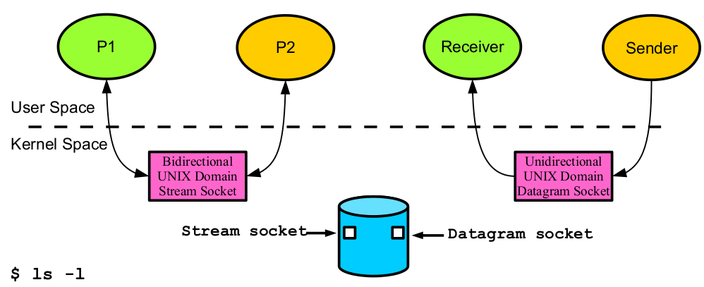

# UNIX Domain Socket

- **UNIX domain socket** is an IPC mechanism using which two or more **related**
or **unrelated** processes, executing on **same** machine can communicate with
each other.
- UNIX domain sockets are **twice** as fast as **TCP** sockets. So they are used in
communication between a **client** and **server** when both are on the **same** host
UNIX domain socket support both **TCP** and **UDP** sockets. Comm is
**bidirectional** with **stream** sockets and **uni**-directional with **datagram** sockets.
- The UNIX domain **datagram** sockets are always **reliable** and don't **reorder** datagrams.
- Instead of **identifying** a server by an IP address and port, a UNIX domain
socket is known by a **pathname**. Obviously the client and server have to
agree on the pathname for them to **find** each other.
- For UNIX domain sockets, **file** and **directory** permissions **restrict** which
processes on the host can open the socket, and thus communicate with the
server. Therefore, UNIX domain sockets provide an advantage over Internet
sockets to which anyone can **connect**, unless extra **authentication** logic is
implemented.

```C
sockfd = socket(AF_UNIX, SOCK_STREAM, 0);
struct sockaddr_un addr;
addr.sun_family = AF_UNIX;
strncpy(addr.sun_path, "socket",sizeof(addr.sun_path)-1);
bind(sockfd, (struct sockaddr*)&addr, sizeof(addr));
```

---



## UNIX Domain Sockets vs Named Pipes

- **Duplex** UNIX domain sockets can be created as stream sockets for **bi**-
directional communication as well as datagram sockets for uni-
directional communication. Named pipes are **uni**-directional only.
- **Distinct clients** In UNIX domain sockets, each client has an
**independent** connection to the server, as server has a separate descriptor
for each client. In case of **named** pipes, many clients may write to the
pipe, but the server cannot **distinguish** the clients from each other,
because the **server** has only one **descriptor** to read from the named pipe.
Therefore UNIX domain sockets should be used if there are multiple
**clients** that need to be **distinguishable**.
- **Method of creating and opening** Sockets are created using
**socket**() and assigned their identity via **bind**() on the server side.
Named pipes are created using **mkfifo**(). To connect to a UNIX
domain socket the normal **socket**() and **connect**() calls are used
and then the socket descriptor can be read as well as written. A process
**open**() a named pipe and then can **either** read or write it.


